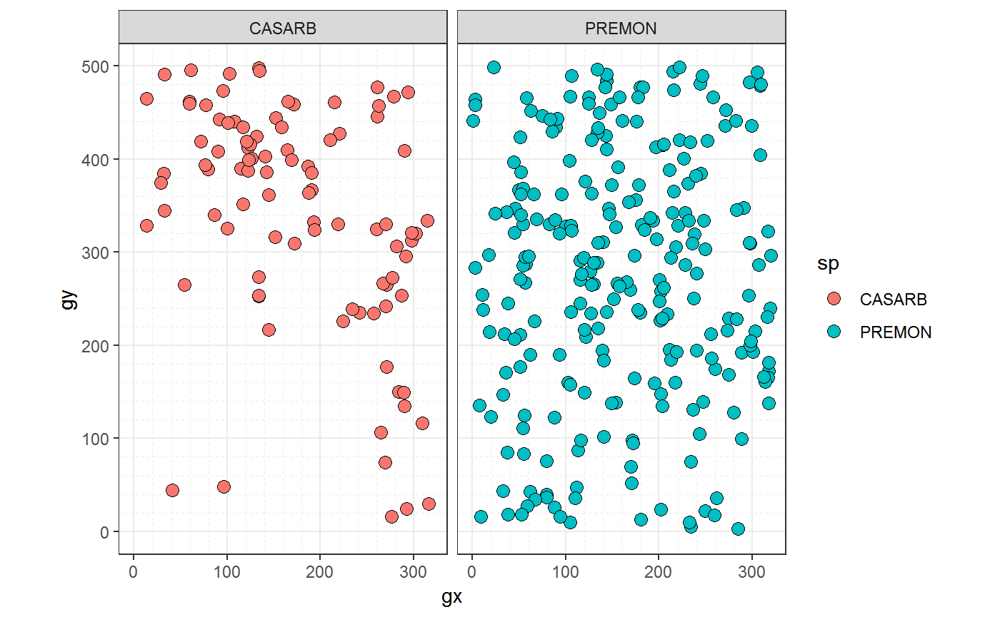

<!-- README.md is generated from README.Rmd. Please edit that file -->

#  Analyze forest diversity and dynamics

[](https://www.tidyverse.org/lifecycle/#experimental)
[](https://travis-ci.org/forestgeo/fgeo)
[](https://codecov.io/github/forestgeo/fgeo?branch=master)
[](https://cran.r-project.org/package=fgeo)

**fgeo** provides functions to manipulate and visualize
[ForestGEO](https://forestgeo.si.edu/) datasets, and to analyze the
abundance, demography, and habitats of forest trees.

  - [Search functions and
    datasets](https://forestgeo.github.io/fgeo/articles/siteonly/reference.html)
  - [Related
    projects](https://forestgeo.github.io/fgeo/#related-projects)
  - [Try **fgeo** online](https://bit.ly/fgeo-demo)
  - [Ask questions, report bugs, or propose
    features](https://github.com/forestgeo/fgeo/issues/new)

## Installation

**Expected R environment**

  - R version is recent
  - All packages are updated (run `update.packages()`)
  - No other R session is running
  - Current R session is clean (click *Session \> Restart R*)

**Option 1: Install directly**

``` r
install.packages("devtools")
devtools::install_github("forestgeo/fgeo", upgrade = "never")
```

(If you reach GitHub’s rate limit see
[`usethis::browse_github_pat()`](https://usethis.r-lib.org/reference/browse_github_pat.html)).

**Option 2: Install via
[**fgeo.install**](https://github.com/forestgeo/fgeo.install#-fgeoinstall)**

``` r
install.packages("devtools")
devtools::install_github("forestgeo/fgeo.install")

# If needed, installs dependencies from CRAN and fgeo packages from GitHub
fgeo.install::install_fgeo()
```

-----

  - To upgrade packages see `?devtools::update_packages()`
  - To remove packages see `?remove.packages()`

<details>

<summary><strong>Tips to avoid or fix common installation
problems</strong></summary>

#### Update R, RStudio, and R packages

  - [How?](https://fgeo.netlify.com/2018/02/08/2018-02-08-update-r-rstudio-and-r-packages/)
  - [Why?](https://fgeo.netlify.com/2018/03/06/2018-03-06-should-i-update-all-my-r-packages-frequently-yes-no-why/)

#### Instruct RStudio not to preserve your workspace between sessions

  - [Why?](https://r4ds.had.co.nz/workflow-projects.html#what-is-real)

In RStudio go to *Tools \> Global
Options…*


#### Use RStudio projects (or the [**here**](https://here.r-lib.org/) package)

  - [Why?](https://www.tidyverse.org/articles/2017/12/workflow-vs-script/)


#### Restart R many times each day

Press Cmd/Ctrl + Shift + F10 to restart RStudio or go to *Session \>
Restart R*.

#### Increase the rate limit to install from GitHub

  - Ensure you have an account on GitHub (<https://github.com/>).
  - Generate a GitHub token named exactly `GITHUB_PAT` by running
    `usethis::browse_github_pat()` in R.
  - You will be sent to GitHub and you should see something like this:


…

  - Make sure your token description says exactly `GITHUB_PAT` and click
    *Generate token*

…


  - Store your new token in the environmental variable `GITHUB_PAT` by
    running `usethis::edit_r_environ()` in R.
  - A file called .Renviron will open. Type the name and value of your
    GitHub token. **Ensure to end this file with a new empty line**.
    Your .Renviron file should now look like this:


…

  - Save and close .Renviron.

#### Install package development utilities

Sometimes you may want to install the *source* version of an R package
from CRAN or GitHub. If that package contains a `src/` folder you will
need to install package development
    utilities.

  - [How?](https://support.rstudio.com/hc/en-us/articles/200486498-Package-Development-Prerequisites)

#### Troubleshoot: error: X11 library is missing: install XQuartz …

If you are a mac user, **fgeo** may fail to install with the error
below. Install XQuartz from <https://www.xquartz.org/> and try to
install **fgeo** again.

``` r
Error : .onLoad failed in loadNamespace() for 'tcltk', details:
  call: fun(libname, pkgname)
  error: X11 library is missing: install XQuartz from xquartz.macosforge.org
```

</details>

## Example

``` r
library(fgeo)
#> -- Attaching packages ------------------------------------------------------- fgeo 0.0.0.9002 --
#> v fgeo.analyze 0.0.0.9003     v fgeo.tool    0.0.0.9005
#> v fgeo.plot    0.0.0.9402     v fgeo.x       0.0.0.9000
#> -- Conflicts --------------------------------------------------------------- fgeo_conflicts() --
#> x fgeo.tool::filter() masks stats::filter()
```

On an interactive session, `fgeo_help()` and `fgeo_browse_reference()`
help you to search documentation.

``` r
if (interactive()) {
  # To search on the viewer; accepts keywords
  fgeo_help()
  # To search on a web browser
  fgeo_browse_reference() 
}
```

The first examples use a dataset that is stored online. For simplicity,
we will focus on only a few species.

``` r
downloaded_census <- download_data("luquillo_stem6_random")

few_species <-  c("PREMON", "CASARB")
census <- filter(downloaded_census, sp %in% few_species)

census
#> # A tibble: 433 x 19
#>    treeID stemID tag   StemTag sp    quadrat    gx    gy MeasureID CensusID
#>     <int>  <int> <chr> <chr>   <chr> <chr>   <dbl> <dbl>     <int>    <int>
#>  1    180    222 1001~ 100095  CASA~ 921     165.   410.        NA       NA
#>  2    180    223 1001~ 100096  CASA~ 921     165.   410.        NA       NA
#>  3    180    224 1001~ 100171  CASA~ 921     165.   410.    617046        6
#>  4    180    225 1001~ 100174  CASA~ 921     165.   410.    617049        6
#>  5    631    775 10069 10069   PREM~ 213      38.3  245.    598429        6
#>  6   1380   1702 1015~ 101560  CASA~ 820     142.   386.    614023        6
#>  7   1840   2240 10208 10208   PREM~ 613     116.   245.    607825        6
#>  8   2849   3421 1031~ 103156  CASA~ 420      79.2  389.    603814        6
#>  9   3354   4054 1037~ 103756  CASA~ 220      32.0  385.    599273        6
#> 10   3354   4055 1037~ 103757  CASA~ 220      32.0  385.        NA       NA
#> # ... with 423 more rows, and 9 more variables: dbh <dbl>, pom <chr>,
#> #   hom <dbl>, ExactDate <date>, DFstatus <chr>, codes <chr>,
#> #   countPOM <dbl>, status <chr>, date <dbl>
```

Species distribution:

``` r
autoplot(sp(census))
```

<!-- -->

Abundance and basal area:

``` r
abundance(census)
#> Warning: `treeid`: Duplicated values were detected. Do you need to pick
#> main stems?
#> # A tibble: 1 x 1
#>       n
#>   <int>
#> 1   433

abundance(
  pick_main_stem(census)
)
#> # A tibble: 1 x 1
#>       n
#>   <int>
#> 1   346

by_species <- group_by(census, sp)

basal_area(by_species)
#> # A tibble: 2 x 2
#> # Groups:   sp [2]
#>   sp     basal_area
#>   <chr>       <dbl>
#> 1 CASARB    535153.
#> 2 PREMON   3892799.
```

Demography:

``` r
# `tree5` and `tree6` come with fgeo
to_df(
  mortality_ctfs(tree5, tree6)
)
#> Detected dbh ranges:
#>   * `census1` = 10.9-323.
#>   * `census2` = 10.5-347.
#> Using dbh `mindbh = 0` and above.
#> # A tibble: 1 x 9
#>       N     D    rate   lower  upper  time  date1  date2 dbhmean
#>   <dbl> <dbl>   <dbl>   <dbl>  <dbl> <dbl>  <dbl>  <dbl>   <dbl>
#> 1    27     1 0.00834 0.00195 0.0448  4.52 18938. 20590.    101.
```

Species-habitats association:

``` r
# This analysis makes sense only for tree tables
tree <- download_data("luquillo_tree5_random")

# `habitat` comes with fgeo
to_df(
  tt_test(tree, habitat)
)
#> Using `plotdim = c(320, 500)`. To change this value see `?tt_test()`.
#> Using `gridsize = 20`. To change this value see `?tt_test()`.
#> # A tibble: 292 x 8
#>    habitat sp     N.Hab Gr.Hab Ls.Hab Eq.Hab Rep.Agg.Neut Obs.Quantile
#>  * <chr>   <chr>  <dbl>  <dbl>  <dbl>  <dbl>        <dbl>        <dbl>
#>  1 1       ALCFLO     2   1443    153      4            0        0.902
#>  2 2       ALCFLO     1    807    778     15            0        0.504
#>  3 3       ALCFLO     0      0    715    885           -1        0    
#>  4 4       ALCFLO     0      0    402   1198           -1        0    
#>  5 1       ALCLAT     0      0    544   1056           -1        0    
#>  6 2       ALCLAT     1   1432    156     12            0        0.895
#>  7 3       ALCLAT     0      0    324   1276           -1        0    
#>  8 4       ALCLAT     0      0    144   1456           -1        0    
#>  9 1       ANDINE     1   1117    466     17            0        0.698
#> 10 2       ANDINE     1   1081    510      9            0        0.676
#> # ... with 282 more rows
```

[Get
started](https://forestgeo.github.io/fgeo/articles/fgeo.html#get-started)

## Related projects

Additional packages maintained by ForestGEO but not included in
**fgeo**:

  - [**fgeo.data**](https://forestgeo.github.io/fgeo.data/): Open
    datasets of ForestGEO.
  - [**fgeo.krig**](https://forestgeo.github.io/fgeo.krig/): Analyze
    soils.

Other packages not maintained by ForestGEO:

  - [CTFS-R Package](http://ctfs.si.edu/Public/CTFSRPackage/): The
    original package of CTFS functions. No longer supported by
    ForestGEO.
  - [**BIOMASS**](https://CRAN.R-project.org/package=BIOMASS): An R
    package to estimate above-ground biomass in tropical forests.

## R code from recent publications by ForestGEO partners

Data have been made available as required by the journal to enable
reproduction of the results presented in the paper. Please do not share
these data without permission of the ForestGEO plot Principal
Investigators (PIs). If you wish to publish papers based on these data,
you are also required to get permission from the PIs of the
corresponding ForestGEO plots.

  - [Soil drivers of local-scale tree growth in a lowland tropical
    forest (Zemunik et
    al., 2018).](https://github.com/SoilLabAtSTRI/Soil-drivers-of-tree-growth)
  - [Plant diversity increases with the strength of negative density
    dependence at the global scale (LaManna et
    al., 2018)](https://github.com/forestgeo/LaManna_et_al_Science)
      - Response \#1: LaManna et al. 2018. Response to Comment on “Plant
        diversity increases with the strength of negative density
        dependence at the global scale” Science Vol. 360, Issue 6391,
        eaar3824. DOI: 10.1126/science.aar3824
      - Response \#2: LaManna et al. 2018. Response to Comment on “Plant
        diversity increases with the strength of negative density
        dependence at the global scale”. Science Vol. 360, Issue 6391,
        eaar5245. DOI: 10.1126/science.aar5245

## Information

  - [Getting help](SUPPORT.md).
  - [Contributing](CONTRIBUTING.md).
  - [Contributor Code of Conduct](CODE_OF_CONDUCT.md).

## Acknowledgments

Thanks to all partners of ForestGEO for sharing their ideas and code.
For feedback on **fgeo**, special thanks to Gabriel Arellano, Stuart
Davies, Lauren Krizel, Sean McMahon, and Haley Overstreet. There are
many other people that deserve special acknowledgment; I thank them in
the documentation and home page of each individual package that make up
the **fgeo** development.
