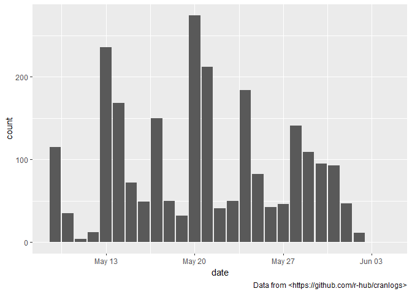

<!-- README.md is generated from README.Rmd. Please edit that file -->

#  Analyze forest diversity and dynamics

<!-- badges: start -->

[](https://www.tidyverse.org/lifecycle/#maturing)
[](https://travis-ci.org/forestgeo/fgeo)
[](https://codecov.io/github/forestgeo/fgeo?branch=master)
[](https://cran.r-project.org/package=fgeo)
<!-- badges: end -->

**fgeo** helps you to install, load, and access the documentation of
multiple packages to analyze forest diversity and dynamics
(<a href=https://forestgeo.github.io/fgeo.analyze>fgeo.analyze</a>,
<a href=https://forestgeo.github.io/fgeo.plot>fgeo.plot</a>,
<a href=https://forestgeo.github.io/fgeo.tool>fgeo.tool</a>,
<a href=https://forestgeo.github.io/fgeo.x>fgeo.x</a>). This
package-collection allows you to manipulate and plot
[ForestGEO](http://www.forestgeo.si.edu/) data, and to do common
analyses including abundance, demography, and species-habitats
associations.

  - [Search functions and
    datasets](https://forestgeo.github.io/fgeo/articles/siteonly/reference.html)
  - [Ask questions, report bugs, or propose
    features](https://github.com/forestgeo/fgeo/issues/new)

## Installation

Make sure your R environment is as follows:

  - R version is recent
  - All packages are updated (run `update.packages()`; maybe use `ask =
    FALSE`)
  - No other R session is running
  - Current R session is clean (click *Session \> Restart R*)

Install the latest stable version of **fgeo** from
[CRAN](https://cran.r-project.org/) with:

``` r
install.packages("fgeo")
```

Or install the development version of **fgeo** from
[GitHub](https://github.com/) with:

``` r
# install.packages("devtools")
devtools::install_github("forestgeo/fgeo.x")
```

  - [How to setup .Rprofile for easiest installation of
    **fgeo**?](https://forestgeo.github.io/fgeo/articles/siteonly/questions-and-answers.html#how-to-setup--rprofile-for-easiest-installation-of-fgeo)
  - [How to update
    **fgeo**?](https://forestgeo.github.io/fgeo/articles/siteonly/questions-and-answers.html#how-to-update-fgeo)
  - [How to remove
    **fgeo**?](https://forestgeo.github.io/fgeo/articles/siteonly/questions-and-answers.html#how-to-remove-fgeo)
  - [How to avoid or fix common installation
    problems?](https://forestgeo.github.io/fgeo/articles/siteonly/questions-and-answers.html#how-to-avoid-or-fix-common-installation-problems)

## Example

``` r
library(fgeo)
#> ── Attaching packages ────────────────────────────────────────── fgeo 1.1.3.9000 ──
#> ✔ fgeo.analyze 1.1.10.9000     ✔ fgeo.tool    1.2.5      
#> ✔ fgeo.plot    1.1.8           ✔ fgeo.x       1.1.4
#> ── Conflicts ────────────────────────────────────────────────── fgeo_conflicts() ──
#> ✖ fgeo.tool::filter() masks stats::filter()
```

### Explore **fgeo**

On an interactive session, `fgeo_help()` and `fgeo_browse_reference()`
help you to search documentation.

    if (interactive()) {
      # To search on the viewer; accepts keywords
      fgeo_help()
      # To search on a web browser
      fgeo_browse_reference() 
    }

### Access and manipulate data

`example_path()` allows you to access datasets stored in your R
libraries.

``` r
example_path()
#>  [1] "csv"           "mixed_files"   "rdata"         "rdata_one"    
#>  [5] "rds"           "taxa.csv"      "tsv"           "vft_4quad.csv"
#>  [9] "view"          "weird"         "xl"

(vft_file <- example_path("view/vft_4quad.csv"))
#> [1] "/home/mauro/R/x86_64-pc-linux-gnu-library/3.6/fgeo.x/extdata/view/vft_4quad.csv"
```

#### `read_<table>()`

`read_vft()` and `read_taxa()` import a ViewFullTable and ViewTaxonomy
from .tsv or .csv files.

``` r
read_vft(vft_file)
#> # A tibble: 500 x 32
#>     DBHID PlotName PlotID Family Genus SpeciesName Mnemonic Subspecies
#>     <int> <chr>     <int> <chr>  <chr> <chr>       <chr>    <chr>     
#>  1 385164 luquillo      1 Rubia… Psyc… brachiata   PSYBRA   <NA>      
#>  2 385261 luquillo      1 Urtic… Cecr… schreberia… CECSCH   <NA>      
#>  3 384600 luquillo      1 Rubia… Psyc… brachiata   PSYBRA   <NA>      
#>  4 608789 luquillo      1 Rubia… Psyc… berteroana  PSYBER   <NA>      
#>  5 388579 luquillo      1 Areca… Pres… acuminata   PREMON   <NA>      
#>  6 384626 luquillo      1 Arali… Sche… morototoni  SCHMOR   <NA>      
#>  7 410958 luquillo      1 Rubia… Psyc… brachiata   PSYBRA   <NA>      
#>  8 385102 luquillo      1 Piper… Piper glabrescens PIPGLA   <NA>      
#>  9 353163 luquillo      1 Areca… Pres… acuminata   PREMON   <NA>      
#> 10 481018 luquillo      1 Salic… Case… arborea     CASARB   <NA>      
#> # … with 490 more rows, and 24 more variables: SpeciesID <int>,
#> #   SubspeciesID <chr>, QuadratName <chr>, QuadratID <int>, PX <dbl>,
#> #   PY <dbl>, QX <dbl>, QY <dbl>, TreeID <int>, Tag <chr>, StemID <int>,
#> #   StemNumber <int>, StemTag <int>, PrimaryStem <chr>, CensusID <int>,
#> #   PlotCensusNumber <int>, DBH <dbl>, HOM <dbl>, ExactDate <date>,
#> #   Date <int>, ListOfTSM <chr>, HighHOM <int>, LargeStem <chr>,
#> #   Status <chr>
```

#### `pick_<what>()` and `drop_<what>()`

**fgeo** is pipe-friendly. You may not use pipes but often they make
code easier to read.

> Use %\>% to emphasize a sequence of actions, rather than the object
> that the actions are being performed on.

– <https://style.tidyverse.org/pipes.html>

`pick_dbh_under()`, `drop_status()` and friends pick and drop rows from
a ForestGEO ViewFullTable or census table.

``` r
(census <- fgeo.x::tree5)
#> # A tibble: 30 x 19
#>    treeID stemID tag   StemTag sp    quadrat    gx    gy MeasureID CensusID
#>     <int>  <int> <chr> <chr>   <chr> <chr>   <dbl> <dbl>     <int>    <int>
#>  1   7624 160987 1089… 175325  TRIP… 722     139.  425.     486675        5
#>  2   8055  10036 1094… 109482  CECS… 522      94.8 424.     468874        5
#>  3  19930 117849 1234… 165576  CASA… 425      61.3 496.     471979        5
#>  4  23746  29677 14473 14473   PREM… 617     100.  328.     442571        5
#>  5  31702  39793 22889 22889   SLOB… 304      53.8  73.8    447307        5
#>  6  35355  44026 27538 27538   SLOB… 1106    203.  110.     449169        5
#>  7  35891  44634 282   282     DACE… 901     172.   14.7    434266        5
#>  8  39705  48888 33371 33370   CASS… 1010    184.  194.     451067        5
#>  9  50184  60798 5830  5830    MATD… 1007    191.  132.     437645        5
#> 10  57380 155867 66962 171649  SLOB… 1414    274.  279.     459427        5
#> # … with 20 more rows, and 9 more variables: dbh <dbl>, pom <chr>,
#> #   hom <dbl>, ExactDate <date>, DFstatus <chr>, codes <chr>,
#> #   nostems <dbl>, status <chr>, date <dbl>

census %>% 
  pick_dbh_under(100)
#> # A tibble: 18 x 19
#>    treeID stemID tag   StemTag sp    quadrat    gx    gy MeasureID CensusID
#>     <int>  <int> <chr> <chr>   <chr> <chr>   <dbl> <dbl>     <int>    <int>
#>  1   7624 160987 1089… 175325  TRIP… 722     139.  425.     486675        5
#>  2  19930 117849 1234… 165576  CASA… 425      61.3 496.     471979        5
#>  3  31702  39793 22889 22889   SLOB… 304      53.8  73.8    447307        5
#>  4  35355  44026 27538 27538   SLOB… 1106    203.  110.     449169        5
#>  5  39705  48888 33371 33370   CASS… 1010    184.  194.     451067        5
#>  6  57380 155867 66962 171649  SLOB… 1414    274.  279.     459427        5
#>  7  95656 129113 1315… 131519  OCOL… 402      79.7  22.8    474157        5
#>  8  96051 129565 1323… 132348  HIRR… 1403    278    40.6    474523        5
#>  9  96963 130553 1347… 134707  TETB… 610     114.  182.     475236        5
#> 10 115310 150789 1652… 165286  MANB… 225      24.0 497.     483175        5
#> 11 121424 158579 1707… 170701  CASS… 811     146.  218.     484785        5
#> 12 121689 158871 1712… 171277  INGL… 515      84.2 285.     485077        5
#> 13 121953 159139 1718… 171809  PSYB… 1318    247.  354.     485345        5
#> 14 124522 162698 1742… 174224  CASS… 1411    279.  210.     488386        5
#> 15 125038 163236 1753… 175335  CASS… 822     153.  426.     488924        5
#> 16 126087     NA 1773… <NA>    CASA… 521      89.8 408.         NA       NA
#> 17 126803     NA 1785… <NA>    PSYB… 622     113.  426          NA       NA
#> 18 126934     NA 1787… <NA>    MICR… 324      47   480.         NA       NA
#> # … with 9 more variables: dbh <dbl>, pom <chr>, hom <dbl>,
#> #   ExactDate <date>, DFstatus <chr>, codes <chr>, nostems <dbl>,
#> #   status <chr>, date <dbl>
```

`pick_main_stem()` and `pick_main_stemid()` pick the main stem or main
stemid(s) of each tree in each census.

``` r
stem <- download_data("luquillo_stem6_random")

dim(stem)
#> [1] 1320   19
dim(pick_main_stem(stem))
#> [1] 1000   19
```

#### `add_<column(s)>()`

`add_status_tree()`adds the column `status_tree` based on the status of
all stems of each tree.

``` r
stem %>% 
  select(CensusID, treeID, stemID, status) %>% 
  add_status_tree()
#> # A tibble: 1,320 x 5
#>    CensusID treeID stemID status status_tree
#>       <int>  <int>  <int> <chr>  <chr>      
#>  1        6    104    143 A      A          
#>  2        6    119    158 A      A          
#>  3       NA    180    222 G      A          
#>  4       NA    180    223 G      A          
#>  5        6    180    224 G      A          
#>  6        6    180    225 A      A          
#>  7        6    602    736 A      A          
#>  8        6    631    775 A      A          
#>  9        6    647    793 A      A          
#> 10        6   1086   1339 A      A          
#> # … with 1,310 more rows
```

`add_index()` and friends add columns to a ForestGEO-like dataframe.

``` r
stem %>% 
  select(gx, gy) %>% 
  add_index()
#> Guessing: plotdim = c(320, 500)
#> * If guess is wrong, provide the correct argument `plotdim`
#> # A tibble: 1,320 x 3
#>       gx    gy index
#>    <dbl> <dbl> <dbl>
#>  1  10.3  245.    13
#>  2 183.   410.   246
#>  3 165.   410.   221
#>  4 165.   410.   221
#>  5 165.   410.   221
#>  6 165.   410.   221
#>  7 149.   414.   196
#>  8  38.3  245.    38
#>  9 143.   411.   196
#> 10  68.9  253.    88
#> # … with 1,310 more rows
```

### Plot data

For simplicity, we will focus on only a few species.

``` r
stem_2sp <- stem %>% 
  filter(sp %in% c("PREMON", "CASARB"))
```

`autoplot()` and friends produce different output depending on the class
of input. You can create different input classes, for example, with
`sp()` and `sp_elev()`:

  - Use `sp(census)` to plot the column `sp` of a `census` dataset –
    i.e. to plot species distribution.

<!-- end list -->

``` r
class(sp(stem_2sp))
#> [1] "sp"         "tbl_df"     "tbl"        "data.frame"

autoplot(sp(stem_2sp))
```

<!-- -->

  - Use `sp_elev(census, elevation)` to plot the columns `sp` and `elev`
    of a `census` and `elevation` dataset, respectively – i.e. to plot
    species distribution and topography.

<!-- end list -->

``` r
elevation <- fgeo.x::elevation
class(sp_elev(stem_2sp, elevation))
#> [1] "sp_elev" "list"

autoplot(sp_elev(stem_2sp, elevation))
```

<!-- -->

### Analyze

#### Abundance

`abundance()` and `basal_area()` calculate abundance and basal area,
optionally by groups.

``` r
abundance(
  pick_main_stem(census)
)
#> # A tibble: 1 x 1
#>       n
#>   <int>
#> 1    30

by_species <- group_by(census, sp)

basal_area(by_species)
#> # A tibble: 18 x 2
#> # Groups:   sp [18]
#>    sp     basal_area
#>    <chr>       <dbl>
#>  1 CASARB      437. 
#>  2 CASSYL     4146. 
#>  3 CECSCH   144150. 
#>  4 DACEXC    56832. 
#>  5 GUAGUI     9161. 
#>  6 HIRRUG      131. 
#>  7 INGLAU      141. 
#>  8 MANBID      167. 
#>  9 MATDOM    45239. 
#> 10 MICRAC        0  
#> 11 OCOLEU      437. 
#> 12 PREMON    78864. 
#> 13 PSYBER        0  
#> 14 PSYBRA      154. 
#> 15 SCHMOR    41187. 
#> 16 SLOBER    23377. 
#> 17 TETBAL      272. 
#> 18 TRIPAL       93.3
```

#### Demography

`recruitment_ctfs()`, `mortality_ctfs()`, and `growth_ctfs()` calculate
recruitment, mortality, and growth. They all output a list.
`as_tibble()` converts the output from a list to a more convenient
dataframe.

``` r
tree5 <- fgeo.x::tree5

as_tibble(
  mortality_ctfs(tree5, tree6)
)
#> Detected dbh ranges:
#>   * `census1` = 10.9-323.
#>   * `census2` = 10.5-347.
#> Using dbh `mindbh = 0` and above.
#> # A tibble: 1 x 9
#>       N     D    rate   lower  upper  time  date1  date2 dbhmean
#>   <dbl> <dbl>   <dbl>   <dbl>  <dbl> <dbl>  <dbl>  <dbl>   <dbl>
#> 1    27     1 0.00834 0.00195 0.0448  4.52 18938. 20590.    101.
```

#### Species-habitats association

`tt_test()` runs a torus translation test to determine habitat
associations of tree species. `as_tibble()` converts the output from a
list to a more convenient dataframe. `summary()` helps you to interpret
the result.

``` r
# This analysis makes sense only for tree tables
tree <- download_data("luquillo_tree5_random")

habitat <- fgeo.x::habitat
result <- tt_test(tree, habitat)
#> Using `plotdim = c(320, 500)`. To change this value see `?tt_test()`.
#> Using `gridsize = 20`. To change this value see `?tt_test()`.

as_tibble(result)
#> # A tibble: 292 x 8
#>    habitat sp     N.Hab Gr.Hab Ls.Hab Eq.Hab Rep.Agg.Neut Obs.Quantile
#>  * <chr>   <chr>  <dbl>  <dbl>  <dbl>  <dbl>        <dbl>        <dbl>
#>  1 1       ALCFLO     2   1443    153      4            0        0.902
#>  2 2       ALCFLO     1    807    778     15            0        0.504
#>  3 3       ALCFLO     0      0    715    885           -1        0    
#>  4 4       ALCFLO     0      0    402   1198           -1        0    
#>  5 1       ALCLAT     0      0    544   1056           -1        0    
#>  6 2       ALCLAT     1   1432    156     12            0        0.895
#>  7 3       ALCLAT     0      0    324   1276           -1        0    
#>  8 4       ALCLAT     0      0    144   1456           -1        0    
#>  9 1       ANDINE     1   1117    466     17            0        0.698
#> 10 2       ANDINE     1   1081    510      9            0        0.676
#> # … with 282 more rows

summary(result)
#> # A tibble: 292 x 3
#>    sp     habitat association
#>    <chr>  <chr>   <chr>      
#>  1 ALCFLO 1       neutral    
#>  2 ALCFLO 2       neutral    
#>  3 ALCFLO 3       repelled   
#>  4 ALCFLO 4       repelled   
#>  5 ALCLAT 1       repelled   
#>  6 ALCLAT 2       neutral    
#>  7 ALCLAT 3       repelled   
#>  8 ALCLAT 4       repelled   
#>  9 ANDINE 1       neutral    
#> 10 ANDINE 2       neutral    
#> # … with 282 more rows
```

## Downloads of fgeo packages

<!-- -->

## Related projects

Additional packages maintained by ForestGEO but not included in
**fgeo**:

  - [**fgeo.data**](https://forestgeo.github.io/fgeo.data/): Open
    datasets of ForestGEO.
  - [**fgeo.krig**](https://forestgeo.github.io/fgeo.krig/): Analyze
    soils.

Other packages not maintained by ForestGEO:

  - [CTFS-R Package](http://ctfs.si.edu/Public/CTFSRPackage/): The
    original package of CTFS functions. No longer supported by
    ForestGEO.
  - [**BIOMASS**](https://CRAN.R-project.org/package=BIOMASS): An R
    package to estimate above-ground biomass in tropical forests.

## R code from recent publications by ForestGEO partners

Data have been made available as required by the journal to enable
reproduction of the results presented in the paper. Please do not share
these data without permission of the ForestGEO plot Principal
Investigators (PIs). If you wish to publish papers based on these data,
you are also required to get permission from the PIs of the
corresponding ForestGEO plots.

  - [Soil drivers of local-scale tree growth in a lowland tropical
    forest (Zemunik et
    al., 2018).](https://github.com/SoilLabAtSTRI/Soil-drivers-of-tree-growth)
  - [Plant diversity increases with the strength of negative density
    dependence at the global scale (LaManna et
    al., 2018)](https://github.com/forestgeo/LaManna_et_al_Science)
      - Response \#1: LaManna et al. 2018. Response to Comment on “Plant
        diversity increases with the strength of negative density
        dependence at the global scale” Science Vol. 360, Issue 6391,
        eaar3824. DOI: 10.1126/science.aar3824
      - Response \#2: LaManna et al. 2018. Response to Comment on “Plant
        diversity increases with the strength of negative density
        dependence at the global scale”. Science Vol. 360, Issue 6391,
        eaar5245. DOI: 10.1126/science.aar5245

## Information

  - [Getting help](https://forestgeo.github.io/fgeo/SUPPORT.html).
  - [Contributing](https://forestgeo.github.io/fgeo/CONTRIBUTING.html).
  - [Contributor Code of
    Conduct](https://forestgeo.github.io/fgeo/CODE_OF_CONDUCT.html).

## Acknowledgments

Thanks to all partners of ForestGEO for sharing their ideas and code.
For feedback on **fgeo**, special thanks to Gabriel Arellano, Stuart
Davies, Lauren Krizel, Sean McMahon, and Haley Overstreet. For all other
help, I thank contributors in the the documentation of the features they
helped with.
