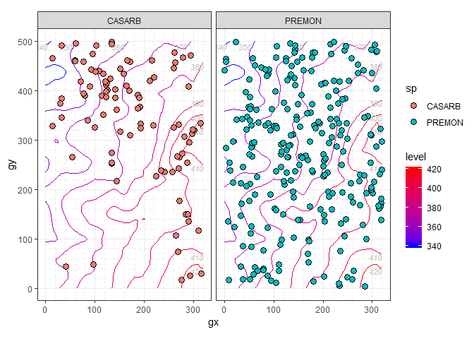

<!-- README.md is generated from README.Rmd. Please edit that file -->

#  Analyze forest diversity and dynamics

[](https://www.tidyverse.org/lifecycle/#experimental)
[](https://travis-ci.org/forestgeo/fgeo)
[](https://codecov.io/github/forestgeo/fgeo?branch=master)
[](https://cran.r-project.org/package=fgeo)

**fgeo** helps you to install, load, and access the documentation of
multiple packages to analyze forest diversity and dynamics. It allows
you to manipulate and plot [ForestGEO](http://www.forestgeo.si.edu/)
data, and to do common analyses including abundance, demography, and
species-habitats associations.

  - [Search functions and
    datasets](https://forestgeo.github.io/fgeo/articles/siteonly/reference.html)
  - [Try **fgeo** online](https://bit.ly/fgeo-demo)
  - [Ask questions, report bugs, or propose
    features](https://github.com/forestgeo/fgeo/issues/new)

## Installation

**Expected R environment**

  - R version is recent
  - All packages are updated (run `update.packages()`)
  - No other R session is running
  - Current R session is clean (click *Session \> Restart R*)

Install the latest stable version of all **fgeo** packages with:

``` r
these_repos <- c(getOption("repos"), "https://forestgeo.github.io/drat")
install.packages("fgeo", repos = these_repos)
```

Or install the development version of all **fgeo** packages with:

``` r
install.packages("devtools")
devtools::install_github("forestgeo/fgeo")
```

-----

  - To remove packages see `?remove.packages()`

<details>

<summary><strong>Tips to avoid or fix common installation
problems</strong></summary>

#### Update R, RStudio, and R packages

  - [How?](https://fgeo.netlify.com/2018/02/08/2018-02-08-update-r-rstudio-and-r-packages/)
  - [Why?](https://fgeo.netlify.com/2018/03/06/2018-03-06-should-i-update-all-my-r-packages-frequently-yes-no-why/)

#### Instruct RStudio not to preserve your workspace between sessions

  - [Why?](https://r4ds.had.co.nz/workflow-projects.html#what-is-real)

In RStudio go to *Tools \> Global
Options…*


#### Use RStudio projects (or the [**here**](https://here.r-lib.org/) package)

  - [Why?](https://www.tidyverse.org/articles/2017/12/workflow-vs-script/)


#### Restart R many times each day

Press Cmd/Ctrl + Shift + F10 to restart RStudio or go to *Session \>
Restart R*.

#### Increase the rate limit to request downloads from GitHub

See
[`usethis::browse_github_pat()`](https://usethis.r-lib.org/reference/browse_github_pat.html).

#### Prepare your system to build packages from source

Sometimes you may need to install the *source* version of an R package
(e.g. from CRAN or
    GitHub).

  - [How?](https://usethis.r-lib.org/articles/articles/usethis-setup.html#prepare-your-system-to-build-packages-from-source)

#### Troubleshoot: error: X11 library is missing: install XQuartz …

If you are a mac user,
[**fgeo.krig**](https://forestgeo.github.io/fgeo.krig/) may fail to
install with the error below. Install XQuartz from
<https://www.xquartz.org/> and try to install
[**fgeo.krig**](https://forestgeo.github.io/fgeo.krig/) again.

``` r
Error : .onLoad failed in loadNamespace() for 'tcltk', details:
  call: fun(libname, pkgname)
  error: X11 library is missing: install XQuartz from xquartz.macosforge.org
```

</details>

## Example

``` r
library(fgeo)
```

### Explore **fgeo**

On an interactive session, `fgeo_help()` and `fgeo_browse_reference()`
help you to search documentation.

    if (interactive()) {
      # To search on the viewer; accepts keywords
      fgeo_help()
      # To search on a web browser
      fgeo_browse_reference() 
    }

### Access and manipulate data

`example_path()` allows you to access datasets stored in your R
libraries.

``` r
example_path()
#>  [1] "csv"           "mixed_files"   "rdata"         "rdata_one"    
#>  [5] "rds"           "taxa.csv"      "tsv"           "vft_4quad.csv"
#>  [9] "view"          "weird"         "xl"

(vft_file <- example_path("view/vft_4quad.csv"))
#> [1] "C:/Users/LeporeM/Documents/R/win-library/3.5/fgeo.x/extdata/view/vft_4quad.csv"
```

#### `read_<table>()`

`read_vft()` and `read_taxa()` import a ViewFullTable and ViewTaxonomy
from .tsv or .csv files.

``` r
read_vft(vft_file)
#> # A tibble: 500 x 32
#>     DBHID PlotName PlotID Family Genus SpeciesName Mnemonic Subspecies
#>     <int> <chr>     <int> <chr>  <chr> <chr>       <chr>    <chr>     
#>  1 385164 luquillo      1 Rubia~ Psyc~ brachiata   PSYBRA   <NA>      
#>  2 385261 luquillo      1 Urtic~ Cecr~ schreberia~ CECSCH   <NA>      
#>  3 384600 luquillo      1 Rubia~ Psyc~ brachiata   PSYBRA   <NA>      
#>  4 608789 luquillo      1 Rubia~ Psyc~ berteroana  PSYBER   <NA>      
#>  5 388579 luquillo      1 Areca~ Pres~ acuminata   PREMON   <NA>      
#>  6 384626 luquillo      1 Arali~ Sche~ morototoni  SCHMOR   <NA>      
#>  7 410958 luquillo      1 Rubia~ Psyc~ brachiata   PSYBRA   <NA>      
#>  8 385102 luquillo      1 Piper~ Piper glabrescens PIPGLA   <NA>      
#>  9 353163 luquillo      1 Areca~ Pres~ acuminata   PREMON   <NA>      
#> 10 481018 luquillo      1 Salic~ Case~ arborea     CASARB   <NA>      
#> # ... with 490 more rows, and 24 more variables: SpeciesID <int>,
#> #   SubspeciesID <chr>, QuadratName <chr>, QuadratID <int>, PX <dbl>,
#> #   PY <dbl>, QX <dbl>, QY <dbl>, TreeID <int>, Tag <chr>, StemID <int>,
#> #   StemNumber <int>, StemTag <int>, PrimaryStem <chr>, CensusID <int>,
#> #   PlotCensusNumber <int>, DBH <dbl>, HOM <dbl>, ExactDate <date>,
#> #   Date <int>, ListOfTSM <chr>, HighHOM <int>, LargeStem <chr>,
#> #   Status <chr>
```

#### Importing multiple censuses from a directory into a list

(This and the following section don’t use **fgeo** because other
packages already do this well.)

Combine `fs::dir_ls()` with `purrr::map()` to import multiple censuses
from a directory into a list:

  - Use `fs::dir_ls()` to create the paths to the files you want to
    import.
  - Use `purrr::map()` to iterate over each path and apply a custom
    function to import them.

<!-- end list -->

``` r
library(purrr)
library(fs)

(rdata_files <- example_path("rdata"))
#> [1] "C:/Users/LeporeM/Documents/R/win-library/3.5/fgeo.x/extdata/rdata"
(paths <- fs::dir_ls(rdata_files))
#> C:/Users/LeporeM/Documents/R/win-library/3.5/fgeo.x/extdata/rdata/tree5.RData
#> C:/Users/LeporeM/Documents/R/win-library/3.5/fgeo.x/extdata/rdata/tree6.RData

# The formula syntax `~ fun(.x)` is a shortcut for `function(.x) fun(.x)`
censuses <- map(paths, ~ get(load(.x)))
censuses
#> $`C:/Users/LeporeM/Documents/R/win-library/3.5/fgeo.x/extdata/rdata/tree5.RData`
#> # A tibble: 3 x 19
#>   treeID stemID tag   StemTag sp    quadrat    gx    gy MeasureID CensusID
#>    <int>  <int> <chr> <chr>   <chr> <chr>   <dbl> <dbl>     <int>    <int>
#> 1    104    143 10009 10009   DACE~ 113      10.3  245.    439947        5
#> 2    119    158 1001~ 100104  MYRS~ 1021    183.   410.    466597        5
#> 3    180    225 1001~ 100174  CASA~ 921     165.   410.    466623        5
#> # ... with 9 more variables: dbh <dbl>, pom <chr>, hom <dbl>,
#> #   ExactDate <date>, DFstatus <chr>, codes <chr>, nostems <dbl>,
#> #   status <chr>, date <dbl>
#> 
#> $`C:/Users/LeporeM/Documents/R/win-library/3.5/fgeo.x/extdata/rdata/tree6.RData`
#> # A tibble: 3 x 19
#>   treeID stemID tag   StemTag sp    quadrat    gx    gy MeasureID CensusID
#>    <int>  <int> <chr> <chr>   <chr> <chr>   <dbl> <dbl>     <int>    <int>
#> 1    104    143 10009 10009   DACE~ 113      10.3  245.    582850        6
#> 2    119    158 1001~ 100104  MYRS~ 1021    183.   410.    578696        6
#> 3    180    225 1001~ 100174  CASA~ 921     165.   410.    617049        6
#> # ... with 9 more variables: dbh <dbl>, pom <chr>, hom <dbl>,
#> #   ExactDate <date>, DFstatus <chr>, codes <chr>, nostems <dbl>,
#> #   status <chr>, date <dbl>
```

#### Exporting multiple censuses from a list into a directory

  - Use `purrr::walk2()` to map over two things in parallel – each
    census to each path to a file. It is similar to `purrr::map2()` and
    `base::Map()` but prints nothing to the console.

<!-- end list -->

``` r
(files <- path_file(names(censuses)))
#> tree5.RData tree6.RData
(folder <- tempdir())
#> [1] "C:\\Users\\LeporeM\\AppData\\Local\\Temp\\1\\RtmpCMorJM"
(paths <- path(folder, files))
#> C:/Users/LeporeM/AppData/Local/Temp/1/RtmpCMorJM/tree5.RData
#> C:/Users/LeporeM/AppData/Local/Temp/1/RtmpCMorJM/tree6.RData

walk2(censuses, paths, ~ save(.x, file = .y))

# Confirm that the folder contains the files we just saved
path_file(dir_ls(folder, regexp = "tree"))
#> tree5.RData tree6.RData
```

#### `pick_<what>()` and `drop_<what>()`

**fgeo** is pipe-friendly. You may not use pipes but often they make
code easier to read.

> Use %\>% to emphasise a sequence of actions, rather than the object
> that the actions are being performed on.

– <https://style.tidyverse.org/pipes.html>

`pick_dbh_under()`, `drop_status()` and friends pick and drop rows from
a ForestGEO ViewFullTable or census table.

``` r
(census <- censuses[[2]])
#> # A tibble: 3 x 19
#>   treeID stemID tag   StemTag sp    quadrat    gx    gy MeasureID CensusID
#>    <int>  <int> <chr> <chr>   <chr> <chr>   <dbl> <dbl>     <int>    <int>
#> 1    104    143 10009 10009   DACE~ 113      10.3  245.    582850        6
#> 2    119    158 1001~ 100104  MYRS~ 1021    183.   410.    578696        6
#> 3    180    225 1001~ 100174  CASA~ 921     165.   410.    617049        6
#> # ... with 9 more variables: dbh <dbl>, pom <chr>, hom <dbl>,
#> #   ExactDate <date>, DFstatus <chr>, codes <chr>, nostems <dbl>,
#> #   status <chr>, date <dbl>

census %>% 
  pick_dbh_under(100)
#> # A tibble: 2 x 19
#>   treeID stemID tag   StemTag sp    quadrat    gx    gy MeasureID CensusID
#>    <int>  <int> <chr> <chr>   <chr> <chr>   <dbl> <dbl>     <int>    <int>
#> 1    119    158 1001~ 100104  MYRS~ 1021     183.  410.    578696        6
#> 2    180    225 1001~ 100174  CASA~ 921      165.  410.    617049        6
#> # ... with 9 more variables: dbh <dbl>, pom <chr>, hom <dbl>,
#> #   ExactDate <date>, DFstatus <chr>, codes <chr>, nostems <dbl>,
#> #   status <chr>, date <dbl>
```

`pick_main_stem()` and `pick_main_stemid()` pick the main stem or main
stemid(s) of each tree in each census.

``` r
stem <- download_data("luquillo_stem6_random")

dim(stem)
#> [1] 1320   19
dim(pick_main_stem(stem))
#> [1] 1000   19
```

#### `add_<column(s)>()`

`add_status_tree()`adds the column `status_tree` based on the status of
all stems of each tree.

``` r
stem %>% 
  select(CensusID, treeID, stemID, status) %>% 
  add_status_tree()
#> # A tibble: 1,320 x 5
#>    CensusID treeID stemID status status_tree
#>       <int>  <int>  <int> <chr>  <chr>      
#>  1        6    104    143 A      A          
#>  2        6    119    158 A      A          
#>  3       NA    180    222 G      A          
#>  4       NA    180    223 G      A          
#>  5        6    180    224 G      A          
#>  6        6    180    225 A      A          
#>  7        6    602    736 A      A          
#>  8        6    631    775 A      A          
#>  9        6    647    793 A      A          
#> 10        6   1086   1339 A      A          
#> # ... with 1,310 more rows
```

`add_index()` and friends add columns to a ForestGEO-like dataframe.

``` r
stem %>% 
  select(gx, gy) %>% 
  add_index()
#> Guessing: plotdim = c(320, 500)
#> * If guess is wrong, provide the correct argument `plotdim`
#> # A tibble: 1,320 x 3
#>       gx    gy index
#>    <dbl> <dbl> <dbl>
#>  1  10.3  245.    13
#>  2 183.   410.   246
#>  3 165.   410.   221
#>  4 165.   410.   221
#>  5 165.   410.   221
#>  6 165.   410.   221
#>  7 149.   414.   196
#>  8  38.3  245.    38
#>  9 143.   411.   196
#> 10  68.9  253.    88
#> # ... with 1,310 more rows
```

### Plot data

For simplicity, we will focus on only a few species.

``` r
stem_2sp <- stem %>% 
  filter(sp %in% c("PREMON", "CASARB"))
```

`autoplot()` and friends produce different output depending on the class
of input. You can create different input classes, for example, with
`sp()` and `sp_elev()`:

  - Use `sp(census)` to plot the column `sp` of a `census` dataset –
    i.e. to plot species distribution.

<!-- end list -->

``` r
class(sp(stem_2sp))
#> [1] "sp"         "tbl_df"     "tbl"        "data.frame"

autoplot(sp(stem_2sp))
```

<!-- -->

  - Use `sp_elev(census, elevation)` to plot the columns `sp` and `elev`
    of a `census` and `elevation` dataset, respectively – i.e. to plot
    species distribution and topography.

<!-- end list -->

``` r
data("elevation")
class(sp_elev(stem_2sp, elevation))
#> [1] "sp_elev" "list"

autoplot(sp_elev(stem_2sp, elevation))
```

<!-- -->

### Analyze

#### Abundance

`abundance()` and `basal_area()` calculate abundance and basal area,
optionally by groups.

``` r
abundance(
  pick_main_stem(census)
)
#> # A tibble: 1 x 1
#>       n
#>   <int>
#> 1     3

by_species <- group_by(census, sp)

basal_area(by_species)
#> # A tibble: 3 x 2
#> # Groups:   sp [3]
#>   sp     basal_area
#>   <chr>       <dbl>
#> 1 CASARB      1669.
#> 2 DACEXC     29865.
#> 3 MYRSPL      1583.
```

#### Demography

`recruitment_ctfs()`, `mortality_ctfs()`, and `growth_ctfs()` calculate
recruitment, mortality, and growth. They all output a list.
`as_tibble()` converts the output from a list to a more convenient
dataframe.

``` r
data("tree5")

as_tibble(
  mortality_ctfs(tree5, tree6)
)
#> Detected dbh ranges:
#>   * `census1` = 10.9-323.
#>   * `census2` = 10.5-347.
#> Using dbh `mindbh = 0` and above.
#> # A tibble: 1 x 9
#>       N     D    rate   lower  upper  time  date1  date2 dbhmean
#>   <dbl> <dbl>   <dbl>   <dbl>  <dbl> <dbl>  <dbl>  <dbl>   <dbl>
#> 1    27     1 0.00834 0.00195 0.0448  4.52 18938. 20590.    101.
```

#### Species-habitats association

`tt_test()` runs a torus translation test to determine habitat
associations of tree species. `as_tibble()` converts the output from a
list to a more convenient dataframe. `summary()` helps you to interpret
the result.

``` r
# This analysis makes sense only for tree tables
tree <- download_data("luquillo_tree5_random")
data("habitat")
result <- tt_test(tree, habitat)
#> Using `plotdim = c(320, 500)`. To change this value see `?tt_test()`.
#> Using `gridsize = 20`. To change this value see `?tt_test()`.

as_tibble(result)
#> # A tibble: 292 x 8
#>    habitat sp     N.Hab Gr.Hab Ls.Hab Eq.Hab Rep.Agg.Neut Obs.Quantile
#>  * <chr>   <chr>  <dbl>  <dbl>  <dbl>  <dbl>        <dbl>        <dbl>
#>  1 1       ALCFLO     2   1443    153      4            0        0.902
#>  2 2       ALCFLO     1    807    778     15            0        0.504
#>  3 3       ALCFLO     0      0    715    885           -1        0    
#>  4 4       ALCFLO     0      0    402   1198           -1        0    
#>  5 1       ALCLAT     0      0    544   1056           -1        0    
#>  6 2       ALCLAT     1   1432    156     12            0        0.895
#>  7 3       ALCLAT     0      0    324   1276           -1        0    
#>  8 4       ALCLAT     0      0    144   1456           -1        0    
#>  9 1       ANDINE     1   1117    466     17            0        0.698
#> 10 2       ANDINE     1   1081    510      9            0        0.676
#> # ... with 282 more rows

summary(result)
#> # A tibble: 292 x 3
#>    sp     habitat association
#>    <chr>  <chr>   <chr>      
#>  1 ALCFLO 1       neutral    
#>  2 ALCFLO 2       neutral    
#>  3 ALCFLO 3       repelled   
#>  4 ALCFLO 4       repelled   
#>  5 ALCLAT 1       repelled   
#>  6 ALCLAT 2       neutral    
#>  7 ALCLAT 3       repelled   
#>  8 ALCLAT 4       repelled   
#>  9 ANDINE 1       neutral    
#> 10 ANDINE 2       neutral    
#> # ... with 282 more rows
```

## Related projects

Additional packages maintained by ForestGEO but not included in
**fgeo**:

  - [**fgeo.data**](https://forestgeo.github.io/fgeo.data/): Open
    datasets of ForestGEO.
  - [**fgeo.krig**](https://forestgeo.github.io/fgeo.krig/): Analyze
    soils.

Other packages not maintained by ForestGEO:

  - [CTFS-R Package](http://ctfs.si.edu/Public/CTFSRPackage/): The
    original package of CTFS functions. No longer supported by
    ForestGEO.
  - [**BIOMASS**](https://CRAN.R-project.org/package=BIOMASS): An R
    package to estimate above-ground biomass in tropical forests.

## R code from recent publications by ForestGEO partners

Data have been made available as required by the journal to enable
reproduction of the results presented in the paper. Please do not share
these data without permission of the ForestGEO plot Principal
Investigators (PIs). If you wish to publish papers based on these data,
you are also required to get permission from the PIs of the
corresponding ForestGEO plots.

  - [Soil drivers of local-scale tree growth in a lowland tropical
    forest (Zemunik et
    al., 2018).](https://github.com/SoilLabAtSTRI/Soil-drivers-of-tree-growth)
  - [Plant diversity increases with the strength of negative density
    dependence at the global scale (LaManna et
    al., 2018)](https://github.com/forestgeo/LaManna_et_al_Science)
      - Response \#1: LaManna et al. 2018. Response to Comment on “Plant
        diversity increases with the strength of negative density
        dependence at the global scale” Science Vol. 360, Issue 6391,
        eaar3824. DOI: 10.1126/science.aar3824
      - Response \#2: LaManna et al. 2018. Response to Comment on “Plant
        diversity increases with the strength of negative density
        dependence at the global scale”. Science Vol. 360, Issue 6391,
        eaar5245. DOI: 10.1126/science.aar5245

## Information

  - [Getting help](SUPPORT.md).
  - [Contributing](CONTRIBUTING.md).
  - [Contributor Code of Conduct](CODE_OF_CONDUCT.md).

## Acknowledgments

Thanks to all partners of ForestGEO for sharing their ideas and code.
For feedback on **fgeo**, special thanks to Gabriel Arellano, Stuart
Davies, Lauren Krizel, Sean McMahon, and Haley Overstreet. For all other
help, I thank contributors in the the documentation of the features they
helped with.
